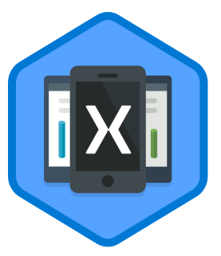

# Build your first cross-platform Xamarin.Forms app with Microsoft Learn

[Microsoft Learn](https://aka.ms/learn) is the new hands-on learning platform that helps you achieve your goals faster. Earn points, levels, and achieve more! [Xamarin learning content is now available on Microsoft Learn](https://aka.ms/learn-xamarin) to help you get started and fully customize your cross-platform mobile apps.

* To get started building cross-platform mobile apps with Xamarin, begin with the [Build mobile apps with Xamarin.Forms](https://docs.microsoft.com/learn/paths/build-mobile-apps-with-xamarin-forms/) learning path on Microsoft Learn.
* To learn more about customizing your Xamarin.Forms apps, jump in with the [Customize your Xamarin.Forms apps](https://docs.microsoft.com/learn/paths/customize-your-xamarin-forms-apps/) learning path.

## Having trouble?

If you need help with Microsoft Learn, see the [troubleshooting guide](https://docs.microsoft.com/en-my/learn/support/troubleshooting) or provide specific feedback by [reporting an issue](mailto:learn-loc@microsoft.com?subject=<Please%20summarize%20your%20issue%20here>&body=<Describe%20your%20issue%20in%20detail%20here.%20Please%20include%20any%20relevant%20error%20messages,%20reproduction%20steps%20and%20screenshots.>%0A%0ANote:%20%20Microsoft%20Learn%20is%20a%20brand%20new%20platform%20and%20we%20are%20striving%20to%20improve%20our%20content%20and%20experience.%20While%20we%20are%20not%20directly%20responding%20to%20all%20customers%20at%20this%20time,%20we%20are%20reviewing%20all%20feedback%20that%20is%20coming%20in.%20We%20want%20to%20hear%20from%20you!%0A%0A%0AURL:%20<Please%20paste%20the%20URL%20of%20the%20page%20where%20you%20are%20having%20trouble%20here>).
